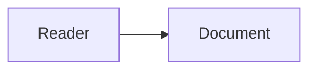

# Authoring Mermaid diagrams

Mermaid describes a diagram as text and lays it out automatically. You write what connects to what, not where anything sits.

## The fence rule

A diagram renders only inside a fenced block tagged with the lowercase word `mermaid`:

````

````

This is the single most common way a diagram silently fails. `Mermaid`, `MERMAID`, `mmd`, and `diagram` all fall through and render as plain text, with no error to notice.

**Never put a diagram in its own file.** A standalone `.mmd` or `.mermaid` file does not render on GitHub. It displays as source, there is no way to reference it from Markdown and have it render, and a raw link to it renders nothing. A diagram lives inside the document it belongs to.

## Choosing a type

| Question the reader has | Type |
| --- | --- |
| What connects to what | `flowchart` |
| What happens in what order, between whom | `sequenceDiagram` |
| What states can this be in, and what moves it | `stateDiagram-v2` |
| What data exists and how it relates | `erDiagram` |
| What types exist and how they relate | `classDiagram` |

Pick by the question, not by the subject. A request process is a sequence diagram when the order matters and a flowchart when the branching matters.

Minimal syntax and a worked example for each type is in `references/diagram-types.md`.

## Readability

A diagram earns its place by being faster to read than the paragraph it replaces. These are the rules that decide whether it is:

**Cap the node count.** Past roughly fifteen nodes, a reader stops seeing the shape and starts tracing lines. Split it, or raise the level of abstraction until it fits.

**One direction.** `TB` for hierarchy and containment, `LR` for a pipeline or a flow through stages. Mixing them makes a reader work out the layout before they can read it.

**Label every edge that is not obvious.** An unlabelled arrow tells a reader that something connects but not how. If every edge means the same thing, say so once in the prose and leave them bare.

**Keep labels short.** A node label is a name, not a sentence. Detail belongs in the surrounding text.

**Never carry meaning in colour alone.** The same page is read in light and dark themes, in print, and by people who do not see the colours apart. If a node is different, say so in its label as well as its fill.

More failures, each with a detection test, are in `references/readability.md`.

## Before you finish

- The fence says exactly `mermaid`, lowercase.
- The diagram is inside the document, not a separate file.
- The type answers the question the reader actually has.
- Every distinction shown in colour is also stated in text.
- Node count is low enough to see the shape at a glance.
- Nothing in the diagram contradicts the prose around it.

## Attribution and scope

Based on [Agents365-ai/mermaid-skill](https://github.com/Agents365-ai/mermaid-skill), MIT licensed.

That project's workflow centres on validating and exporting diagrams to PNG, SVG, or PDF, using the `mmdc` command line tool with headless Chrome, or the Kroki HTTP service. None of that is carried here. Diagrams written for Markdown are rendered by the host that displays them, so there is nothing to export, no dependency to install, and no diagram source sent to a third party. What is kept is type selection, syntax, and readability.
