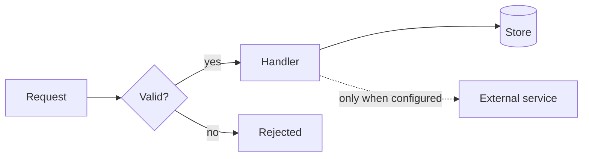
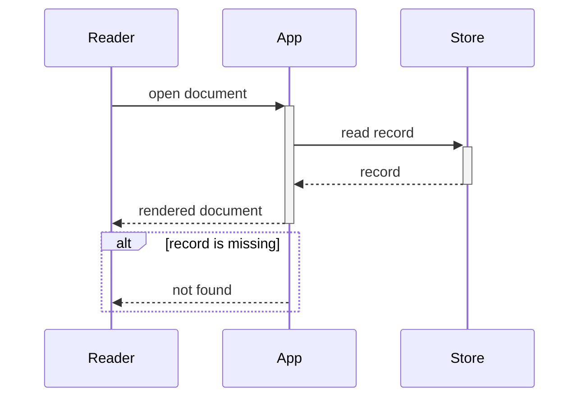
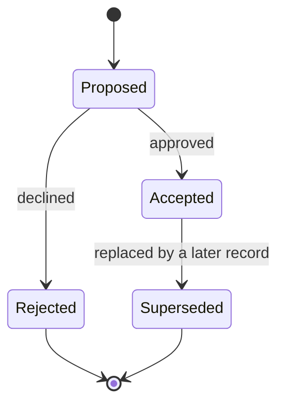
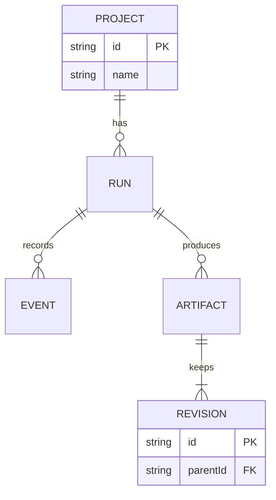
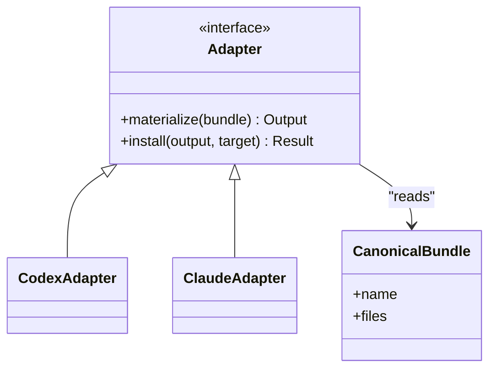

# Diagram types

Minimal syntax and one worked example per type. Every example is a complete diagram that renders as written.

## Flowchart

For what connects to what. The most common choice and the most common wrong choice, since branching logic is a flowchart but ordered exchange is a sequence diagram.

Direction is `TB` or `LR`. Node shapes: `["box"]`, `("rounded")`, `{"diamond"}`, `[("store")]`, `(("circle"))`.

Edges: `-->` solid, `-.->` dashed, `==>` thick, `---` no arrow. Label an edge with `-->|"label"|`.

Group with `subgraph name["Label"] ... end`. Style with `classDef` and `class`, never as the only way a distinction is shown.

## Sequence

For what happens in what order, between whom. Use it when the order is the point. Time runs downward.

`->>` is a call, `-->>` a return, `-)` an asynchronous message. `activate` and `deactivate` show when a participant is working, and `+`/`-` on an arrow do the same in one line.

`alt`/`else`, `opt`, `loop`, and `par` cover branching, optional steps, repetition, and parallel work. `Note over A,B: text` annotates without adding a message.

## State

For what states something can be in and what moves it between them. Use it when the same thing behaves differently depending on where it is, which a flowchart cannot show.

`[*]` is the start and the end. Transitions carry the event that causes them.

Nest with `state Name { ... }`. Use `<<choice>>` for a branch that is not a state.

## Entity relationship

For what data exists and how it relates. Cardinality is the reason to choose this over a flowchart.

Left and right symbols read as: `||` exactly one, `o|` zero or one, `}|` one or more, `}o` zero or more. `--` is identifying, `..` non-identifying.

Attribute blocks are optional. Leave them out when the relationships are the point.

## Class

For what types exist and how they relate. Worth using only when inheritance or composition is what the reader needs.

`<|--` inheritance, `*--` composition, `o--` aggregation, `-->` association. Visibility: `+` public, `-` private, `#` protected.

## Quoting

Quote a label whenever it contains a space, punctuation, or a reserved word: `a["Read and report"]` rather than `a[Read and report]`. Unquoted labels containing `end`, brackets, or a colon are the most frequent parse failure.

Use ` ` for a line break inside a label. A raw newline ends the statement.
